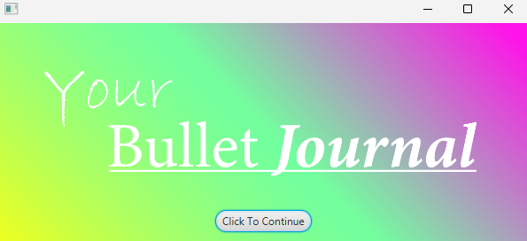
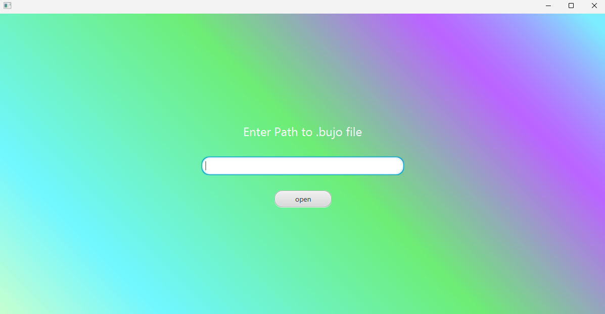
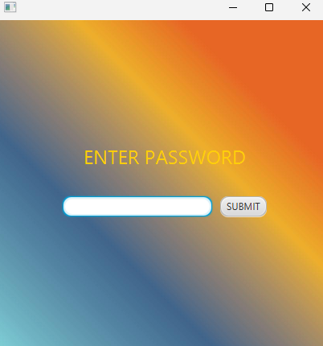
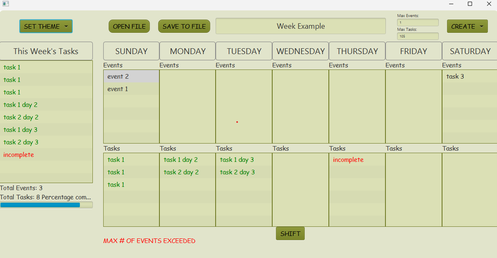

# 3500 PA05 Project Repo

[PA Write Up](https://markefontenot.notion.site/PA-05-8263d28a81a7473d8372c6579abd6481)

# Bullet Journal
Welcome to our bullet journaling app.

## Pitch
This app contains every* feature you need to create a unique and helpful bullet journal. 
You will be able to create a **Week View**, create **Events** and **Tasks**, **saving journals**. 

But that's not it, there's also endless* room for customization. You'll be able to select from a list of preset 
**themes** and set the **start of the week** as Sunday or Monday.

What about UI? We got that too. You'll be able to **set warnings for maximum tasks or events**, see a **progress bar**
of how far you've completed this week's overall tasks, and even **edit tasks or events**!

We're not done yet! There's SECURITY! Password protect your files to ensure only you can access your journal!
*security is not guaranteed. **If you do not have a password, the program will bypass the scene**.

## Images

## SOLID Principles
### Single Responsibility
Our code follows single responsibility because each class only accomplishes what is necessary for that class. For 
instance, all of our scenes have their own controller and their own viewers. Each model only accesses what is 
necessary for themselves, or for navigating to another scene.
### Open-Closed
Our code is open for extension because we have overarching abstract classes and interfaces which allows someone to
easily add new scenes through adding new controllers and viewers. Our code is closed for modification because only
methods that are required to be public, such as getters and observers, while all others are set as private or protected.
### Liskov Substitution
Our code follows Liskov's Substitution Principle because whenever one of our classes takes in some interface, we pass 
in the subclass. This means that we are not passing in interfaces when not necessary. And also keeps the program working
without breaking.
### Interface Segregation
While our interfaces are not very complicated, most only have one or two methods, our abstract classes are split into
an AbstractSceneController and a SecondarySceneController meaning that the classes that extend either of these classes 
are only getting what they require
### Dependency Inversion
Many of the core functionality of our controllers are defined within an Abstract class. Additionally, many of our 
methods/classes depend on a class being a member of an abstract class. And we also pass in objects to 
controllers/viewers whenever necessary instead of defining a new object. 

## Extending This Application
This application is extensible because for things such as adding a new theme, all a developer needs to do is add a new 
field to the Theme enumeration and add the case to the css file in the WeekDisplayController. 

For adding new scenes, a developer simply needs to extend the AbstractSceneView class for the viewer and extend either
AbstractSceneController or SecondarySceneController. A developer wanting to add new scenes that goes out from the 
WeekDisplay would extend the SecondarySceneController.

And then if a developer would like to add new fields to the .bujo, they would simply need to add them to their 
respective xJson file.

## Attribution
Us